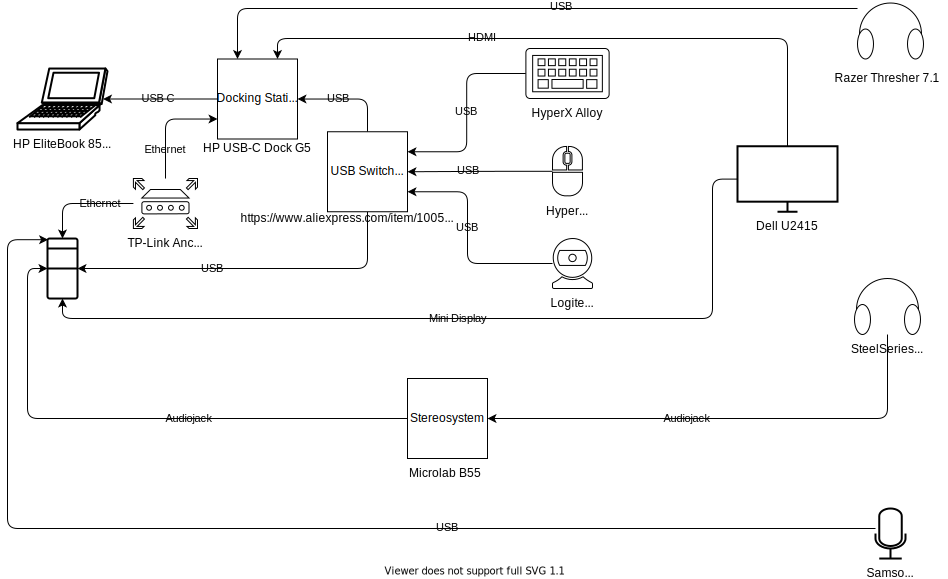

# My Home Setup

## Practicing Design Thinking & testing draw.io

### TODO

* Assosiate drawio file with svg
* CI/CD for image files from .drawio
* Add legend
* Different line types for wireless connections
* Interactive elements <https://drawio-app.com/interactive-diagrams-with-custom-links-and-actions/>
